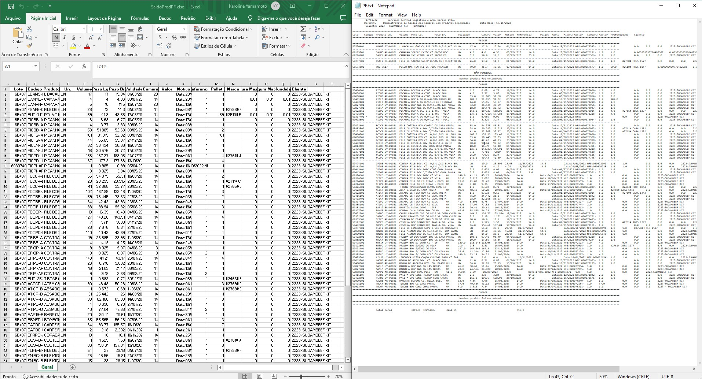
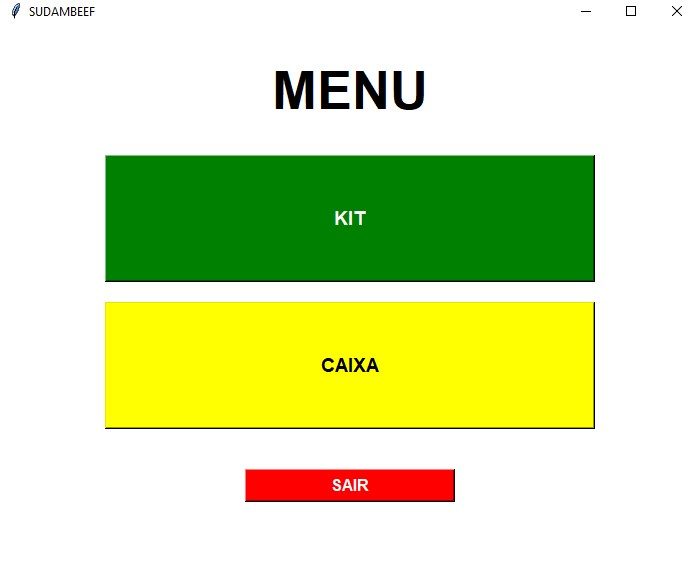
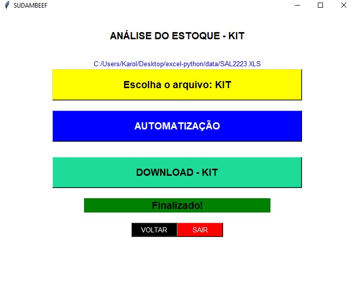

<h1 align="center"> Python - create Excel and Notes </h1>

    Analyzing Excel or Notes, perform data filtering and creation new Note. 
    Interface to perform analyzes with Tkinter.

  <a href="#-technologies">Technologies</a>&nbsp;&nbsp;&nbsp;|&nbsp;&nbsp;&nbsp;
  <a href="#-project">Project</a>&nbsp;&nbsp;&nbsp;|&nbsp;&nbsp;&nbsp;
  <a href="#-references">References</a>&nbsp;&nbsp;&nbsp;|&nbsp;&nbsp;&nbsp;
  <a href="#memo-licence">Licence</a>

  

 

## Result

    

## Tkinter

    
    

## 🚀 Technologies

This project was developed with the following technologies:

- [Python](https://www.python.org/)
- [Library - Pandas](https://pandas.pydata.org/docs/)
- [Library - Tkinter](https://docs.python.org/3/library/tk.html)

## 💻 Project

Project with the pandas library, allowing more knowledge about this tool

START - PIP
- create folder: note
- pip install pandas tk PyInstaller
- change path variables 
- pyinstaller index.py
  * build/ dist/ index.spec
- App: build/ dist/ note/ index.spec
- dist - index/index.exe

PATH VARIABLES
- create folder in download
- alter path util/download.py
- alter path util/rename.py
- alter index.py

PYTHON
- Extension to run in VSCode: Python and Pylance

FOLDERS:
- test/xls - analyze excel
- test/excel - python result in excel
- test/note - python result in note
- test/project - learning tests

LEARNED:
- tkinter interface
- import function and libraries 
- add function in button
- change background color to loading
- get the list of directories
- check if the list is empty
- browse files with types
- read and write each line with open() utf-8
- delete files of directory
- list: append and delete items
- condiction to insert path or click in button
- move file to other folder 
- rename file with the data 

CONDITIONS:
- note to be controlled needs to be closed, so there is no data conflict
- automation needs to be performed only once, as the file is already created

AUTOMATION:
- change in the order of products
- lines during product sections

Links Usefull:

 Python Download - https://www.python.org/downloads/

 VSCode Download -  https://code.visualstudio.com/download

 Git Download -  https://git-scm.com/download/win

## 🔖 References

Filtering rows and columns in a table:
https://www.youtube.com/watch?v=6M0PUNw7faE

How to read file line by line with Python:
https://www.youtube.com/watch?v=76loQGxS-Zg

Manipulating rows of pandas dataframes:
https://www.youtube.com/watch?v=-22JkOmJeSI

Select Rows & Columns by Name or Index in Pandas DataFrame using [ ], loc & iloc:
https://www.geeksforgeeks.org/select-rows-columns-by-name-or-index-in-pandas-dataframe-using-loc-iloc/

Delete all files directory python:
https://www.techiedelight.com/pt/delete-all-files-directory-python/

Remove list elements that contain given String in Python:
https://bobbyhadz.com/blog/python-remove-elements-from-list-that-contain-string

Adding a license to a repository:
https://docs.github.com/en/communities/setting-up-your-project-for-healthy-contributions/adding-a-license-to-a-repository

## :memo: Licence

This project is under the MIT license.

---

Made with ♥ by Karoline :wave: [Let's program together!](https://www.linkedin.com/in/karoline-hikari-yamamoto/)

